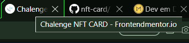
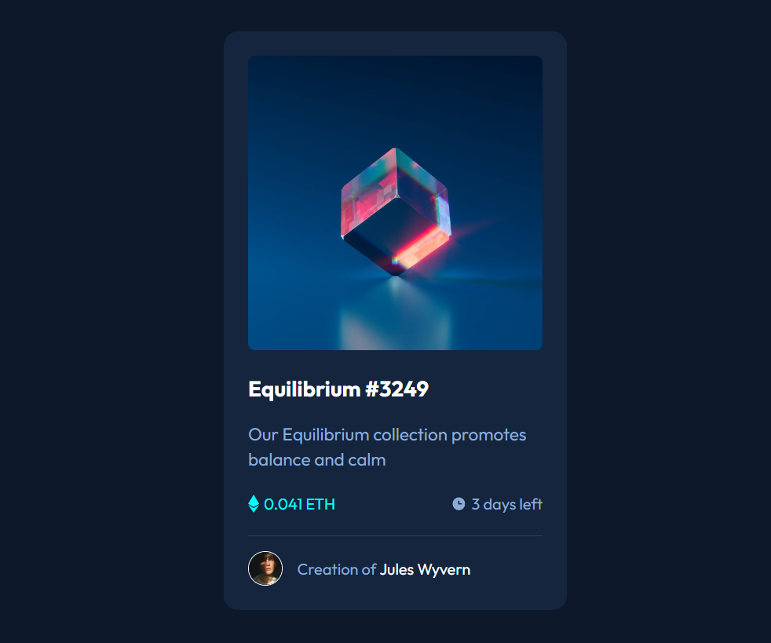

Esta página foi codada com o auxílio da equipe do DevemDobro, que propuseram o exercício originalmente do site frontendmentor.io e que foi usado em aula (workshop) com o intuito de esclarecer aos alunos os passos que devem ser tomados na estruturação de um novo projeto, ao que se deve atentar ao recebê-lo e a importância so planejamento inicial, antes de sequer trabalhar no código em si.

Para a estruturação dessa página foram usadas ferramentas de auxílio como o programa LightShot, para visão de divisão física da página, e a extensão PerfectPixel, para melhor comparar a página final com a do projeto.

Foram disponibilizadas imagens, favicon, fonte e cores, além de screenshots de como a página deveria ficar em telas maiores (laptops) e em telas menores (celulares).

Inicialmente, a divisão "física" da página foi realizada e em seguida a estruturação do arquivo html que serviria de base para a página e as estilizações.

Ao decorrer do projeto foram utilizadas diferentes classes nas tags 
, <a>, 
 e nas imagens, podendo assim estilizar cada situação quanto necessário.

Foram criados três aquivos CSS pois cada um tem sua finalidade prórpia: 
- foi criado um arquivo para resetar algumas características padrão (reset.css) que não seriam necessárias e poderiam causar conflitos no momento da estilização. 
- foi criado um arquivo para adicionar as variáveis (variables.css) inerentes as cores do projeto inicial. Este arquivo foi criado separadamente pois se caso haja a necessidade de trocar alguma cor ou a paleta de cores da página, o processo pode ser realizado facilmente direto neste arquivo.
- foi criado o arquivo de estilos (style.css), que é onde estão estilizadas as tags do html , tentando-se manter a ordem em que as mesmas aparecem no HTML (de cima para baixo, da esquerda para a direita).

Após adicionar a imagem foram utilizadas estilizações para a passagem do mouse (pseudoclasse "hover" + pseudo elementos "before" e "after"), com a adição também de imagem marca d'água (com aplicação de opacidade).

A pseudoclasse "hover" também foi utilizada para o nome do autor e da moeda NFT, com adição de mudanã de coloração.

Os ícones de "preço" e "tempo" foram adicionadas com o auxílio do pseudo-elemento "before", para serem fixas antes do texto.

A responsividade da página foi aplicada com o ajuste do container principal, não necessitanto utilizar media query.

Segue print do título da página e o favicon disponibilizado inserido:

Segue print de como a página é vista em uma tela grande:

Segue print de como a página é vista em uma tela pequena:

